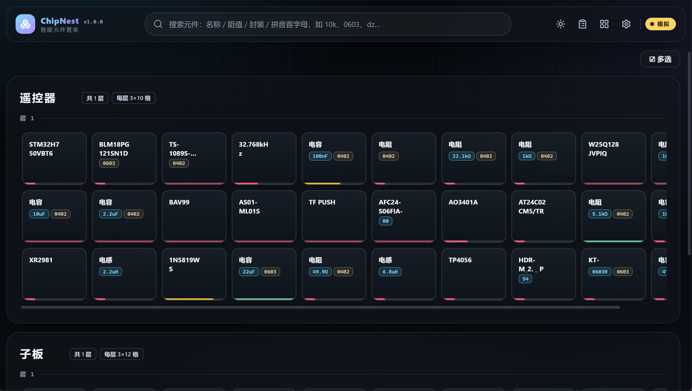
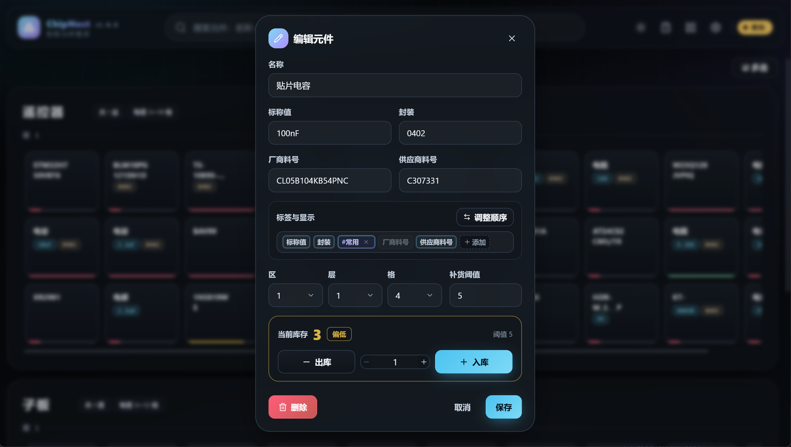
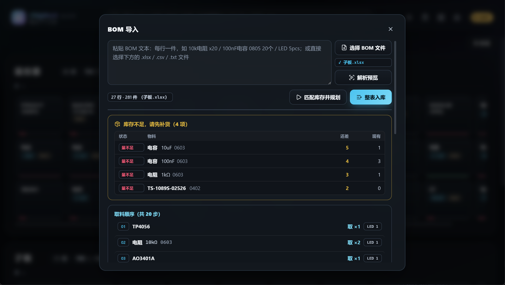
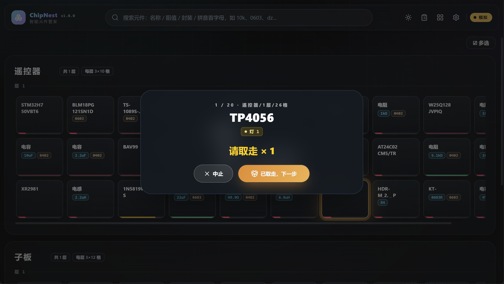

# ChipNest · 智能元件管家

面向电子工程师的桌面元件仓库工具：用卡片网格管理你的元件库，支持模糊搜索、BOM 导入与引导取料，
可接 ESP32 + NeoPixel 灯带做槽位指示。Windows 安装包即装即用，无需 Python。

[](https://github.com/DWZ753/chip-nest/releases/latest)


## 界面预览

**主界面** —— 分区网格、格子上的字段与标签、底部库存状态色带：



**编辑元件** —— 字段与标签统一成一条可拖动的显示链，可逐个开关是否显示：



**BOM 导入与规划** —— 解析统计、缺料清单、按灯带顺序的取料路线：



**引导取料** —— 按灯带顺序逐格高亮，每步自动出库：



## 功能

- 元件库：卡片网格分区分层管理，每个区的**层数、行数、列数都能单独设置**（新建区沿用默认值）；
- 搜索：支持名称、阻值、封装、料号与拼音首字母模糊匹配，命中卡片呼吸高亮。
- 标签：每格可打标签，内部标签参与搜索；另可挑 1–3 个“展示标签”直接显示在格子上。
- BOM：粘贴文本或导入 .xlsx（常见 EDA/商城导出格式）→ 解析预览 → 匹配库存规划取料路线；
  或按“购买清单”逐行选格入库。
- 引导取料：按灯带顺序逐格高亮，每步自动原子出库并记账，缺料先提示补货。
- 批量操作：多选模式勾选多个格子后批量删除。
- 搬家：点「移动」按钮进入移动模式，点一个格子拿起，再点虚线空格放下；按 Esc 或「退出移动」结束。
- 联网识别：在编辑/新建窗口输入料号或描述（`10k 0603`、`C14663`、`STM32H750VBT6`），
  自动查出立创编号、型号、封装、阻值/容值并填好各栏，可切换候选；查不到或断网不影响手工填写。
- BOM 整表入库：可对还没有编号的行一键「识别料号」，自动补厂商料号与立创编号（逐行可单独识别）。
- 灯带序号：设置里「按位置重排」可按 区→层→格 把灯号理顺，修老库里撞号的灯。
- 数据维护：设置里可一键清空所有元件与流水、布局回到初始状态；清空前自动留一份 JSON 备份。
- 硬件联动：USB 串口连接 ESP32，槽位库存不足红灯、充足熄灭、引导取料高亮；无硬件时自动模拟模式。
- 界面：深色科技风主题（可切换浅色）、字号可整体缩放、毛玻璃卡片；仓库布局与应用设置分入口管理。

## 安装

### Windows

- 下载安装包：**[Releases 页面](https://github.com/DWZ753/chip-nest/releases/latest)**
  （附件 `ChipNest-Setup-<版本>.exe`；本地构建产物在 `electron/release/`），按向导安装；
  数据保存在 `%APPDATA%/ChipNest/`，升级安装不会丢失。
- 当前正式版：**v1.1.0**（界面左上角与「设置 → 版本」可核对）。
- 升级前请在任务管理器结束 `ChipNest.exe`，避免安装时文件被占用。
- 首次运行若提示 SmartScreen，选择“更多信息 → 仍要运行”（安装包暂未签名）。

### 源码运行

```bash
# 后端（Python 3.12+）
cd backend
python -m venv .venv
./.venv/Scripts/python.exe -m pip install -r requirements.txt
./.venv/Scripts/python.exe -m uvicorn app.main:app --port 8765

# 前端（另开终端，Node 20+）
cd frontend
npm install
npm run dev        # http://127.0.0.1:5173

# 桌面壳（可选，自动拉起后端）
cd electron
npm install
npm start
```

> 升级界面缓存说明：新版本会自带清理 Web 缓存；如遇“界面没变化”，请先结束任务管理器里的
`ChipNest.exe` 再重新打开。

## ESP32 灯带联动（可选）

- 固件：`hardware/chipnest_led_server/chipnest_led_server.ino`（Arduino IDE + Adafruit NeoPixel 库）。
- 接线：灯带 DIN → 开发板引脚（固件顶部 `LED_PIN` 宏），GND 共地；数量多时独立 5V 供电。
- 协议：115200 8N1 行协议；握手 `PING`→`PONG`；点灯 `LED:<序号>,<R>,<G>,<B>`。
- 无 ESP32 时程序自动进入模拟模式（顶栏显示“模拟”），全部功能可正常体验。

## 使用提示

- 顶栏：搜索框、BOM 导入、仓库布局（网格/区名/手工入库/操作流水）、设置（外观/字号/硬件状态/清空数据）。
- 想从零开始：设置 → 数据 →「清空所有数据」，需手输「清空」二字确认；备份文件在数据目录的 `backups/` 下。
- 点任意格子：编辑元件；点空位：新建。多选模式：右上角“☑ 多选”。
- 搬家：先点右上角「移动」（按钮变蓝），点一个格子拿起、再点任意虚线空格放下；只能放到空格，
  搬完上方会提示从哪搬到哪，操作流水里也留一条。
- 联网识别：点格子打开元件窗口，最上面一栏输入 `10k 0603` / `C14663` / `STM32H750VBT6` 后回车或点「识别」，
  自动填好名称、标称值、封装、厂商料号、供应商编号（供应商编号=立创编号），并显示关键参数与数据手册链接。
- BOM 整表入库：进「BOM 导入 → 整表入库」后点「识别料号」批量补编号，也可逐行点右侧小图标识别。
- 灯带：设置里「按位置重排」一次性把灯带序号与槽位顺序对齐。
- BOM 弹窗支持 .xlsx / .csv / .txt；整表入库前每行可先改好再选格。

## 常见问题

1. **端口被占用 / 启动慢**：后端默认 127.0.0.1:8765；若同时有多个实例会互抢，先结束其他 ChipNest。
2. **连接不到串口**：只探测 USB 类串口（蓝牙虚拟串口可能阻塞），特殊口可设
   `CHIPNEST_SERIAL_PORTS=COM3,COM8` 指定。
3. **布局缩小后元件不见了**：网格上方会出现提示条，一键搬回空格。
4. **安装 electron 依赖慢**：国内网络设 `ELECTRON_MIRROR=https://npmmirror.com/mirrors/electron/`。
5. **误点了「清空所有数据」**：清空前会自动备份到数据目录的 `backups\` 下
   （打包版即 `%APPDATA%\ChipNest\backups\`），里面是完整 JSON，照着手工录回即可。

## 开发与打包

- 后端测试：`backend` 目录执行 `./.venv/Scripts/python.exe -m pytest`。
- 前端构建：`cd frontend && npm run build`。
- 打包安装包：先按上文构建前端，再执行 `backend` 下 PyInstaller 命令（见
  `backend/run_desktop.py` 说明）与 `electron` 下 `npx electron-builder --win nsis`。
- 代码仓库：https://github.com/DWZ753/chip-nest（版本号见左上角与“设置 → 版本”）。

## 开源许可

本项目基于 MIT 许可证开源。