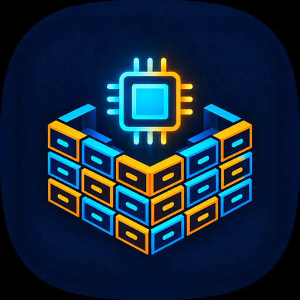
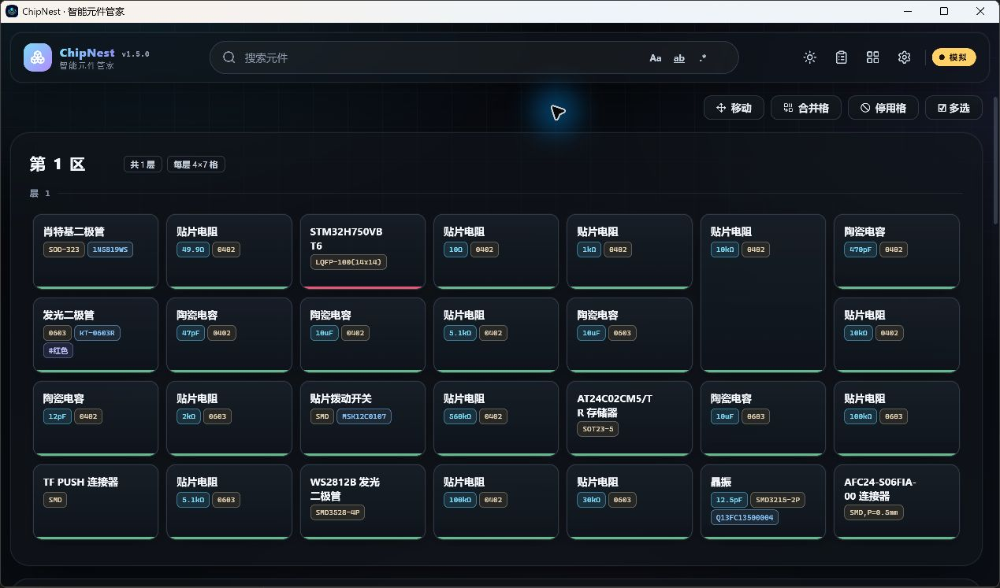
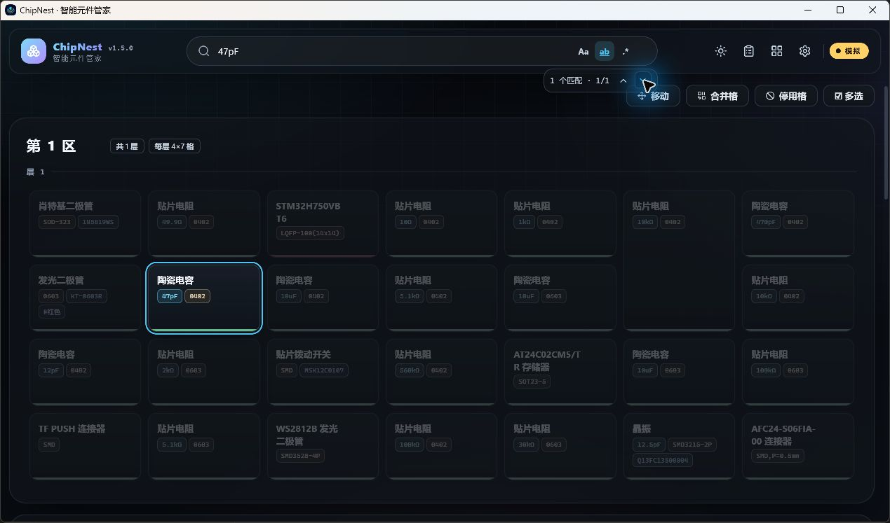
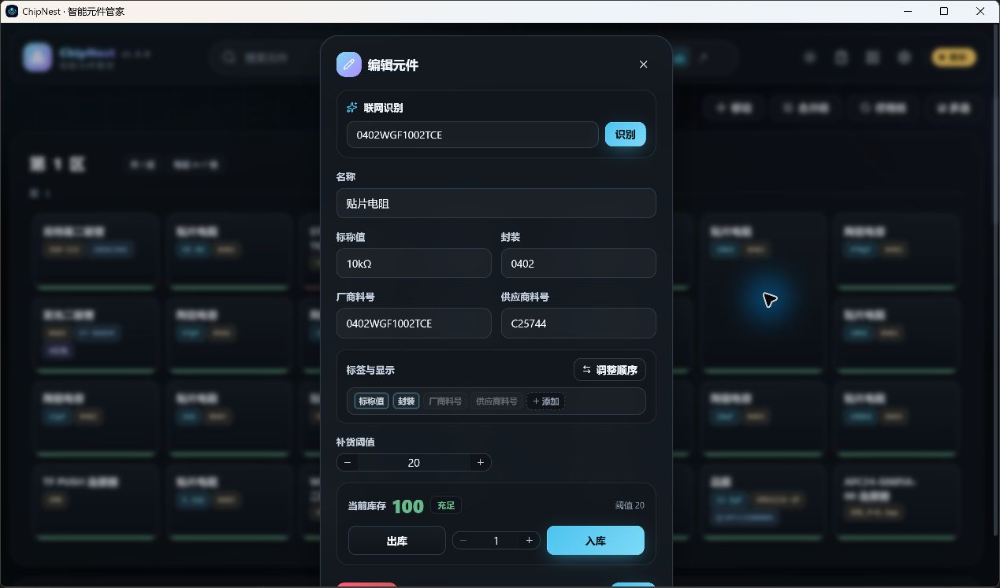

# ChipNest · 智能元件管家

ChipNest 用货架网格管理电子元件的位置、库存和取料流程。
当前正式版为 **v1.6.0**，提供 Windows 安装包，安装后无需配置 Python。
没有 ESP32 硬件时，软件会显示「模拟」状态，库存管理功能照常使用。

[下载安装包](https://github.com/DWZ753/chip-nest/releases/latest) ·
[查看 v1.6.0 更新](docs/release-notes-v1.6.0.md) ·
[反馈问题](https://github.com/DWZ753/chip-nest/issues)



## 安装与升级

1. 从 [Releases](https://github.com/DWZ753/chip-nest/releases/latest)
   下载 `ChipNest-Setup-1.6.0.exe`。
2. 升级前关闭正在运行的 `ChipNest.exe`，再运行安装程序。
3. 启动后在左上角或「设置 → 版本」核对版本号。

库存保存在 `%APPDATA%\ChipNest\chipnest.db`。
覆盖安装和卸载程序不会主动删除这份数据；需要迁移电脑时，
请一并保存该目录中的数据库和 `backups` 文件夹。

## 从哪里开始

1. 打开「仓库布局」，按实际货架设置区名及每个区的层、行、列。
2. 回到网格，点空格新建元件；点已有卡片修改字段或入库、出库。
3. 用顶部搜索框定位元件，或打开「库存」进行入库与 BOM 取料。

网格右上角提供「移动」「合并格」「停用格」「多选」。
最近的库存和位置操作可在「仓库布局 → 最近操作」查看及逐步撤销。

## 当前功能

| 场景 | 能做什么 |
| --- | --- |
| 仓库布局 | 各区独立设置名称、层数、行数和列数；格子与实物货架对应。 |
| 元件档案 | 记录名称、标称值、封装、厂商及供应商料号、标签、库存和补货阈值。 |
| 库存操作 | 手工入库、BOM 整表入库、出库、库存状态提示和操作流水；缺货时阻止超量出库。 |
| 格子管理 | 搬家、互换、多格共用一个元件、停用坏格及批量选择。 |
| BOM | 在「库存」中粘贴文本或导入 `.xlsx`、`.csv`、`.txt`；解析、查缺料、规划取料，也可整表入库。 |
| 数据维护 | 合并重复元件、撤销最近操作、清空前自动备份、从 JSON 备份恢复。 |
| 外观 | 深浅主题、字号和多格卡片的合并或分开显示。 |

### 版本号

版本号采用 `主版本.次版本.修订版本`（`MAJOR.MINOR.PATCH`）：

- **主版本**：包含不兼容的改动。
- **次版本**：增加功能或兼容的数据结构。
- **修订版本**：修复问题，以及文案和打包调整。

当前版本 `1.6.0` 表示第 1 个主版本系列、第 6 次功能更新，
目前没有额外的修订号。

### 搜索与定位

搜索覆盖名称、标称值、封装、料号、标签和中文名称的拼音首字母。
默认进行模糊匹配；搜索框中的 `Aa`、`ab`、`.*` 分别切换
**区分大小写**、**全字匹配**、**正则表达式**，三个选项可以组合。
例如全字搜索 `47pF` 时，`470pF` 不会命中。

匹配卡片保持明亮，其余卡片与停用格变暗，原有格子不会从布局中消失。
搜索框下方显示命中数量；用上下按钮或回车、Shift+回车逐项定位。
同一个元件占用多个格子时只计为一个命中。



### 编辑元件与库存

点卡片打开元件窗口。字段和展示标签可调整显示顺序，
补货阈值可手动设置；入库和出库直接在窗口底部操作。
「联网识别」可根据料号或描述填写候选信息，断网时仍可手工录入。



### BOM 与取料

在「库存」中进行 BOM 文本粘贴及文件导入。解析后可以：

- 规划取料顺序，查看库存可满足的步骤和缺料清单。
- 启动引导取料；确认每一步后扣减库存并留下流水。
- 将购买清单整表入库，逐行核对字段并用「选格」指定空格。

选格时窗口会暂时让开，在主页面点空格即完成选择，Esc 可取消。
联网识别可以为整表入库的行补充料号。

### 数据与备份

「设置 → 数据」可以选择 JSON 备份恢复。恢复会覆盖当前仓库，
软件在覆盖前先备份现有数据。
「清空所有数据」也会先写入 JSON 备份，备份文件放在
`%APPDATA%\ChipNest\backups\`。
请勿把安装目录中的程序文件当作库存数据库。

## ESP32 灯带（可选）

仓库可通过 USB 串口连接 ESP32，按槽位灯号指示库存和引导取料。
示例固件位于
`hardware/chipnest_led_server/chipnest_led_server.ino`，
使用 Arduino IDE 与 Adafruit NeoPixel 库。
协议为 115200 8N1 行文本：`PING` → `PONG`，
点灯命令为 `LED:<序号>,<R>,<G>,<B>`。

目前实体货架硬件尚未制作完成，串口灯带联动还未做实物验证。
没有硬件时应用会使用模拟模式。

## 源码运行

开发环境需要 Python 3.12+、Node.js 20.19.x 或 22.12+，以及 npm。
在不同终端分别启动后端与前端：

```powershell
cd backend
python -m venv .venv
.\.venv\Scripts\python.exe -m pip install -r requirements.txt
.\.venv\Scripts\python.exe -m uvicorn app.main:app --port 8765
```

```powershell
cd frontend
npm install
npm run dev
```

前端开发地址为 `http://127.0.0.1:5173`。
如需用 Electron 壳查看开发界面，保留前端终端、停止独立后端，
然后在 `electron` 执行 `npm install` 和 `npm run dev`；
Electron 会自行启动后端。

## 构建 Windows 安装包

先在 `frontend` 执行 `npm run build`，
再在 `backend` 使用 PyInstaller 冻结 `run_desktop.py`：

```powershell
.\.venv\Scripts\python.exe -m PyInstaller --noconfirm --onefile `
  --name chipnest-backend --collect-all pypinyin `
  --collect-submodules uvicorn --hidden-import aiosqlite `
  --hidden-import greenlet --hidden-import websockets `
  --hidden-import python_multipart run_desktop.py
```

最后在 `electron` 执行 `npx electron-builder --win nsis`。
安装包生成在 `electron/release/`。
版本同步、测试和发布步骤见 [HANDOFF.md](HANDOFF.md)。

## 常见问题

- **启动后界面没有更新**：关闭所有 `ChipNest.exe` 进程后重新打开。
- **提示端口 8765 被占用**：先退出其他 ChipNest 实例或开发服务。
- **布局缩小后找不到元件**：网格会提示游离元件，可将其搬回空格。
- **串口未连接**：应用会进入模拟模式；硬件连接不影响本地库存操作。
